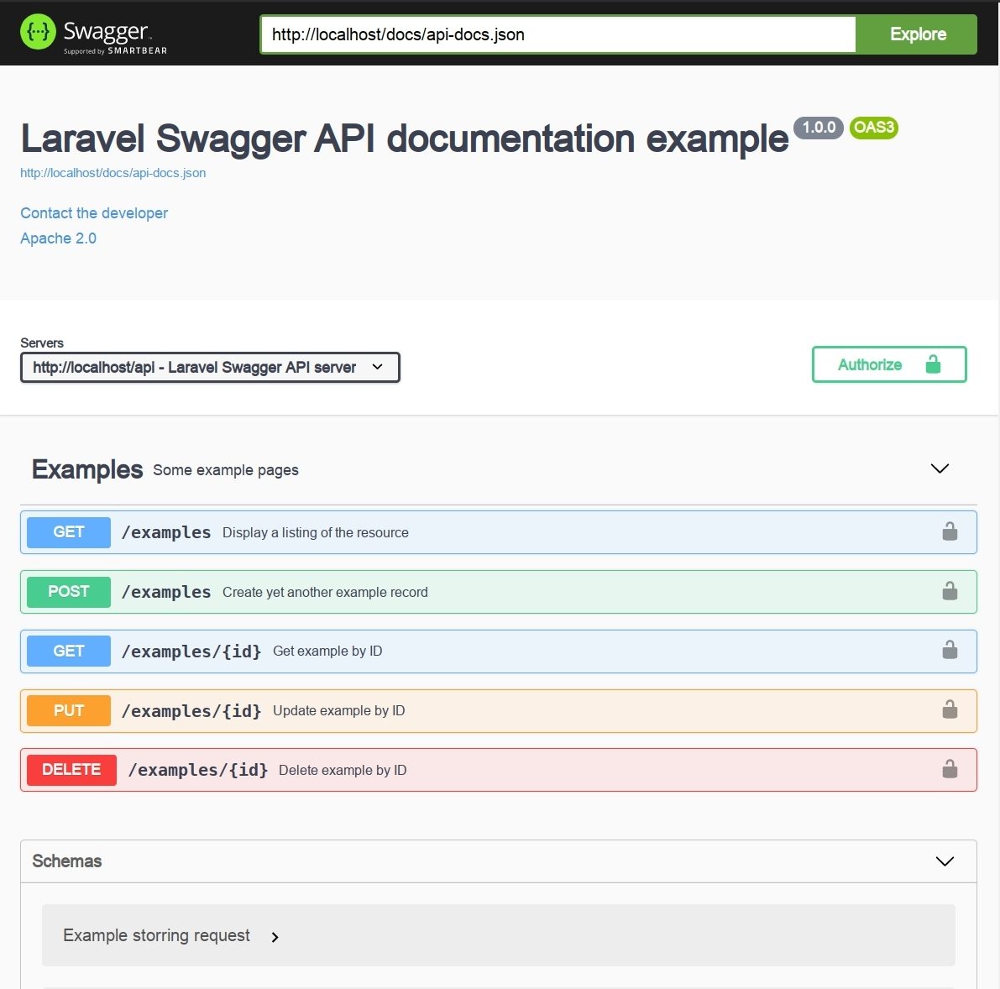

# Laravel 8 + Swagger demo application

This application based on Docker containers, here is the list:

* mysql - Database server
* phpmyadmin - For management of MySQL
* laravel - Login pages, API and VueJS

## How to use

### 1. Preparation

Clone the repo and change your work directory to root of sources

    git clone https://github.com/EvilFreelancer/laravel-swagger-example.git
    cd laravel-swagger-example
    cp docker-compose.dist,yml docker-compose.yml

Inside `docker-compose.yml` you need change the values to the ones you
need, for example you do not want to tun this project on `8080` port, to
fix that you need just change this line `80:8080` to what you need (`7777:8080`).

Run first iteration of Docker environment

    docker-compose up -d

### 2. Install all required components

I assume that there are no development tools on your computer, so you
need to login to Laravel container:

    docker-compose exec laravel bash

Install all dependencies

    composer install

### 3. Set up the application

Create database and seed tables:

    php artisan migrate:fresh --seed

### 4. Generate swagger frontend

Generate interactive documentation:

    php artisan l5-swagger:generate

## The End

Now you just need open following page [http://localhost/api/documentation](http://localhost/api/documentation) in your browser.

Thanks for reading!
